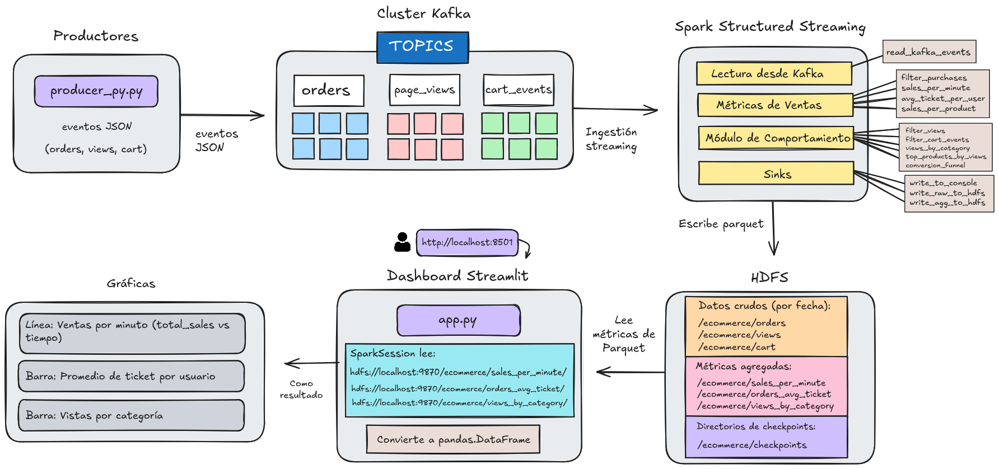

## ORDEN DE EJECUCION

Seguir este orden exactamente.

---

## 1️⃣ Iniciar Kafka

Desde la raiz del proyecto:

```bash
infra/start-kafka.sh
```

Kafka queda corriendo en localhost:9092.

## 2️⃣ Crear topicos de Kafka (solo una vez)

```bash
infra/create-topics.sh
```

Topicos creados:

    orders

    cart_events

    page_views

## 3️⃣ Crear estructura en HDFS (solo una vez)

```bash
hdfs/create_hdfs_dirs.sh
```

Estructura creada:

```bash
/ecommerce/
├── orders
├── views
├── cart
└── checkpoints
```

## 4️⃣ Crear y activar venv del Producer

Desde la raiz del proyecto:

```bash
python -m venv venv
source venv/bin/activate
pip install kafka-python
```

## 5️⃣ Ejecutar el Producer de Eventos

Con el venv activado:

```bash
python producers/producer_py.py
```

Este proceso envia eventos continuamente a Kafka simulando el sistema de e-commerce.

⚠️ No cerrar esta terminal

## 6️⃣ Ejecutar Spark Streaming Job

En otra terminal (no usar venv):

```bash
/opt/spark/bin/spark-submit \
  --master local[*] \
  --packages org.apache.spark:spark-sql-kafka-0-10_2.13:4.0.1 \
  spark/spark_streaming_job.py
```

Este job:

    Consume eventos desde Kafka

    Procesa datos en tiempo real

    Muestra resultados en consola

    Escribe datos crudos y agregados en HDFS

⚠️ No cerrar esta terminal

## 7️⃣ (Opcional) Verificar eventos en Kafka

Para debug o verificacion:

```bash
/opt/kafka/bin/kafka-console-consumer.sh \
  --bootstrap-server localhost:9092 \
  --topic page_views
```

## 8️⃣ Verificar datos en HDFS

Despues de unos segundos:

```bash
hdfs dfs -ls /ecommerce
hdfs dfs -ls /ecommerce/sales_per_minute
```

Se generan archivos Parquet automaticamente por batch.

## 9️⃣ Crear y activar venv del Dashboard

Entrar a la carpeta del dashboard:

```bash
cd dashboard
python -m venv venv_dashboard
source venv_dashboard/bin/activate
pip install streamlit pyspark pandas
```

## 🔟 Ejecutar el Dashboard

Con el venv del dashboard activado:

```bash
streamlit run app.py
```

Abrir en el navegador:

http://localhost:8501

📈 Metricas Visualizadas

    Ventas por minuto

    Promedio de ticket por usuario

    Vistas por categoria

    Top productos mas vistos

## Arquitectura del Sistema



## Poster Academico

[Ver poster academico](docs/poster.pdf)